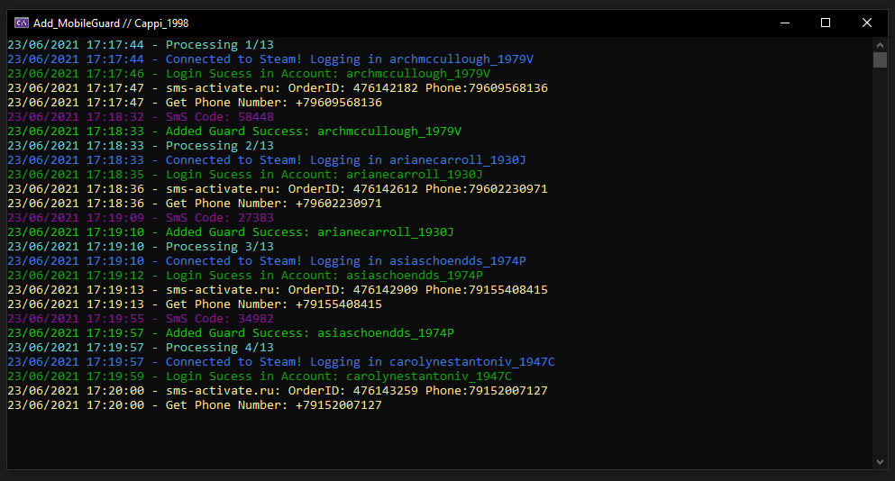

## Description
Program to automatically add Mobile Guard Authenticator to Steam accounts.

If you want a program to create steam accounts check the project [SteamAccountCreateHelper](https://github.com/Cappi1998/SteamAccountCreateHelper).

## Getting Started

### Prerequisites
[.NET Core 5.0](https://dotnet.microsoft.com/download) or higher required. 

- Run the program for the first time to create the configuration files.
- Configure the "Config.json" configuration file.

### Config.json
- <a href="#AccountsFormatInput">AccountsFormatInput</a> => input format of accounts that will be processed. you can use "SteamAccountCreateHelper" or "login:pass:email:emailpass"
- <a href="#PhoneServiceToUse">PhoneServiceToUse</a> => Phone Service that will be used to obtain rental numbers.
- PhoneServiceApiKey => API Key for the chosen Phone Service.
- AccountsPerNumber => number(int) of accounts to be linked in each number.
- Country => check <a href="#PhoneServiceToUse">PhoneServiceToUse</a> to find out how to get the country code

## AccountsFormatInput
- "SteamAccountCreateHelper" - for accounts made using the program [SteamAccountCreateHelper](https://github.com/Cappi1998/SteamAccountCreateHelper), you need to put the accounts' .txt files in the folder Database/Accounts_ToAdded_Guard.
- "login:pass:email:emailpass" - you need to put the accounts in a .txt file named `Accounts_ToAdded_Guard.txt` inside the Database/ folder.

## PhoneServiceToUse
- "sms-activate.ru" - I checked the desired Country Code [here](https://sms-activate.ru/en/api2).
- "cheapsms.ru" - Config.Country doesn't matter.

---
 

## DISCLAIMER
This project is provided on AS-IS basis, without any guarantee at all. Author is not responsible for any harm, direct or indirect, that may be caused by using this plugin. You use this project at your own risk.
